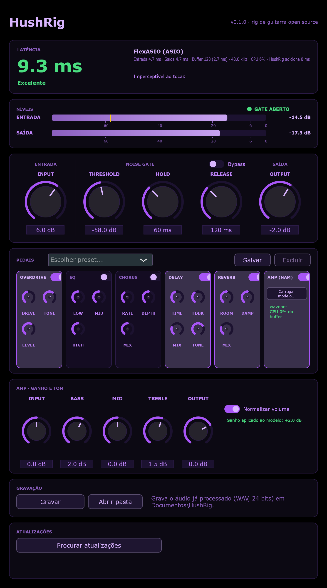
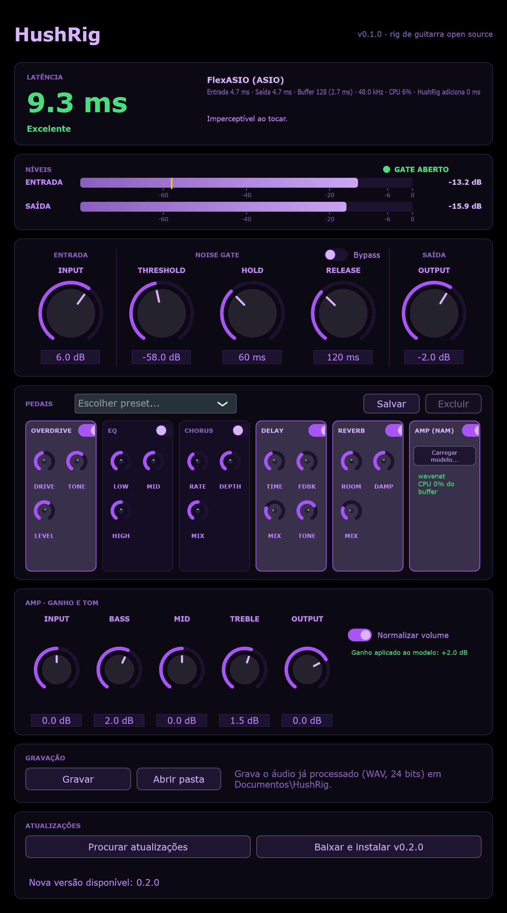

<div align="center">

# 🎸 HushRig

**Rig de guitarra open source para Windows — standalone e VST3.**
Toque direto no PC com baixa latência e sem chiado.

[](https://github.com/DevEduNunes/hushrig/actions/workflows/build.yml)


[](LICENSE)



</div>

---

## Por que o HushRig?

Guitarra ligada direto no PC costuma dar dois problemas: **chiado** (captadores single coil, ganho alto, ruído da USB) e **delay** (drivers de áudio padrão do Windows com buffers grandes).
O HushRig ataca os dois: um **noise gate de latência zero** feito para guitarra e um caminho de áudio pensado para rodar com **ASIO**.

> ⚠️ Projeto em fase inicial (v0.1). Hoje ele tem o gate e os ganhos. Os pedais estão no [roadmap](#-roadmap).

## ✨ Recursos

- **Medidor de latência**: mostra em ms a latência real reportada pelo driver (entrada, saída, buffer, CPU) com dicas para reduzir
- **Medidores de nível** de entrada e saída, com marcador do threshold e indicador de gate aberto/fechado
- **Noise gate** com threshold, hold e release — sem lookahead, ou seja, **zero latência** adicionada
- **Tema escuro** (preto e roxo) com knobs rotativos
- **Ganho de entrada e de saída** com transição suave (sem cliques)
- **Standalone e VST3** com o mesmo código
- **Entrada mono** espelhada nos dois canais (guitarra em estéreo no fone)
- **Atualização dentro do app**: procura novas versões no GitHub e instala com um clique
- **Instalador completo** que já instala o driver ASIO [FlexASIO](https://github.com/dechamps/FlexASIO)

## 🖼️ Screenshots

<table>
  <tr>
    <td align="center"><br><sub>Tela principal</sub></td>
    <td align="center"><br><sub>Atualização disponível</sub></td>
  </tr>
</table>

> As imagens são geradas automaticamente pelo CI a cada build (`tools/Screenshots.cpp`). Os valores de latência e de nível nelas são **de exemplo**.

## 📦 Instalação

1. Baixe o `HushRig-Setup-x.y.z.exe` na página de [Releases](https://github.com/DevEduNunes/hushrig/releases).
2. Execute o instalador. Você escolhe os componentes:
   - **HushRig** (aplicativo)
   - **Plugin VST3** (instalado em `Common Files\VST3`)
   - **FlexASIO** (driver ASIO de baixa latência)
3. Abra o HushRig.

> O Windows pode mostrar o aviso do SmartScreen ("editor desconhecido"), porque o instalador ainda não é assinado digitalmente. Clique em **Mais informações → Executar assim mesmo**.

## 🎚️ Como usar

1. Conecte a interface de áudio e a guitarra. **Use fones** para evitar microfonia.
2. Em **Options** (canto do app), escolha o driver **ASIO → FlexASIO**, a entrada e a saída. Desmarque *Mute audio input*.
3. Reduza o **buffer** (comece com 256 amostras e vá descendo até começar a estalar) para diminuir a latência.
4. Ajuste o **Gate Threshold** até o chiado sumir quando você não está tocando. Se o gate cortar o fim das notas, aumente o **Release**.

| Parâmetro | O que faz |
|---|---|
| **Input Gain** | Ganho aplicado antes do gate |
| **Gate Threshold** | Nível abaixo do qual o gate fecha |
| **Gate Hold** | Tempo que o gate segura aberto depois que o sinal cai |
| **Gate Release** | Quão rápido o gate fecha |
| **Output Gain** | Volume de saída |
| **Gate bypass** | Desliga o gate |

### Dicas contra o chiado

O software ajuda, mas confira também a origem:
- Ganho do preamp da interface alto demais
- Captadores single coil (chegar perto do monitor aumenta o zumbido)
- Notebook ligado na fonte (teste na bateria) e outra porta USB
- Cabo da guitarra

## 🔄 Atualizações

No app standalone, clique em **Procurar atualizações**. Se houver uma versão nova, aparece o botão **Baixar e instalar**: o app baixa o instalador da release, confere o SHA-256 e reinicia já atualizado.

## 🗺️ Roadmap

- [x] Esqueleto JUCE (Standalone + VST3) e CI no GitHub Actions
- [x] Noise gate (threshold, hold, release) com testes
- [x] Instalador com FlexASIO e atualização dentro do app
- [x] Medidor de latência e medidores de nível
- [ ] Pedais: overdrive, delay, reverb, chorus e EQ
- [ ] Cadeia de pedais reordenável e presets
- [ ] Gravação em WAV
- [ ] Amp sim com modelos [Neural Amp Modeler](https://www.neuralampmodeler.com/)
- [ ] Interface própria com pedais visuais

## 🛠️ Compilando

O build oficial roda no GitHub Actions (`.github/workflows/build.yml`). Para compilar localmente você precisa do Visual Studio 2022 (carga de trabalho C++) e do CMake:

```bash
cmake -B build -DCMAKE_BUILD_TYPE=Release
cmake --build build --config Release
ctest --test-dir build -C Release --output-on-failure
```

Os binários ficam em `build/HushRig_artefacts/Release/`.

```
src/dsp/        # DSP sem dependência do JUCE (testável)
src/update/     # verificação de versão, SHA-256 e atualizador
src/            # processador e editor do plugin
tests/          # testes (Catch2)
tools/          # gerador de screenshots do README
installer/      # script do instalador (Inno Setup)
```

## 🤝 Contribuindo

Issues e pull requests são bem-vindos. Para lançar uma versão, crie uma tag `vX.Y.Z`: o CI compila e publica a release com o instalador.

## 📄 Licença

[AGPL-3.0](LICENSE), compatível com a licença do [JUCE](https://juce.com).
