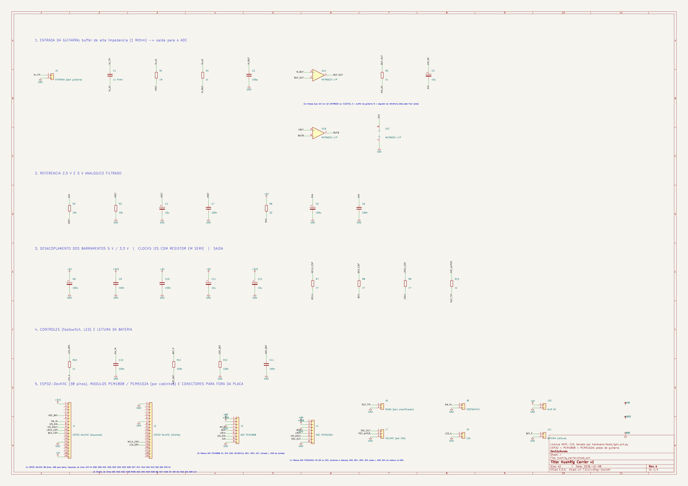
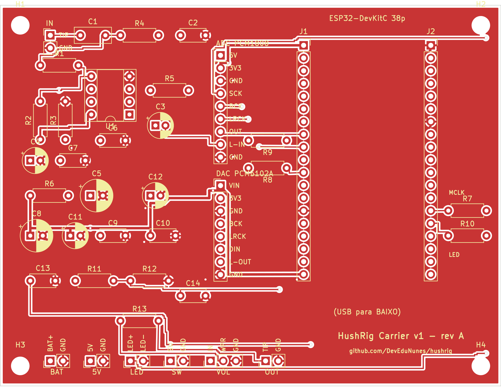
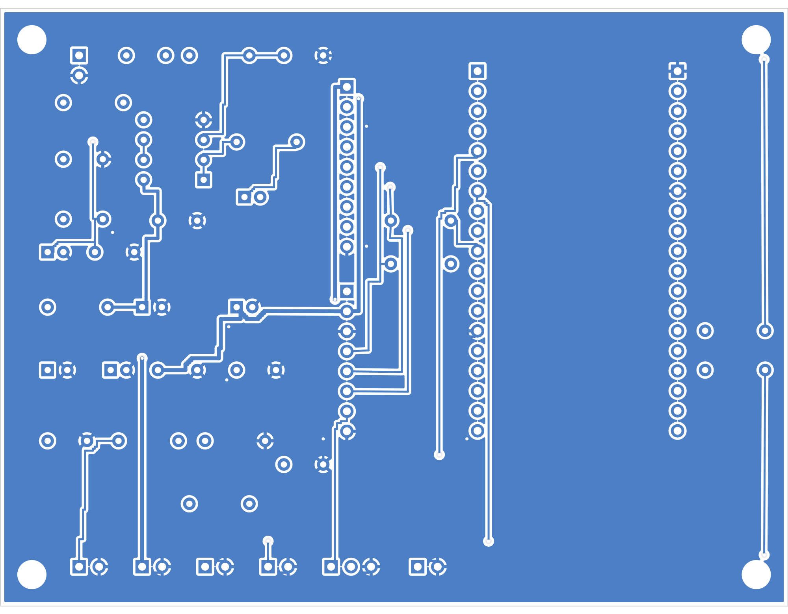
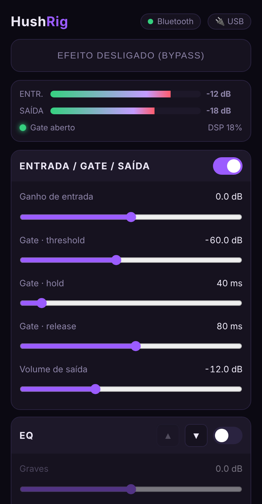

# 🎛️ HushRig Hardware — pedal com ESP32

```
Guitarra ──► [buffer] ──► ADC ──► ESP32 (gate + pedais) ──► DAC ──► [nível] ──► Amplificador
                                      ▲
                     Celular (Bluetooth LE) ──┘   página de controle no navegador do Android
```

O mesmo DSP do app (`src/dsp/`: gate, overdrive, EQ, chorus, delay, reverb) roda no ESP32 **sem cópia**: o firmware inclui os mesmos headers. Quem toca na guitarra ouve o noise gate de latência zero na frente do amplificador.

Dois alvos, o mesmo código:

| Alvo | Placa | Controle | Para quê |
|---|---|---|---|
| **`esp32`** | ESP32 comum (DevKitC 38 pinos, ~US$ 4) | **Bluetooth LE** | o **barato e compacto** (recomendado) |
| `esp32s3` | ESP32-S3 | BLE **e** WiFi (página servida pelo próprio pedal) | quem quer controlar sem depender de internet/HTTPS |

> **Status:** o núcleo (`firmware/src/Rig.h`) e a página de controle (inclusive o caminho BLE, com um GATT simulado) estão testados no PC. O **firmware ESP-IDF ainda não foi compilado nem rodou em hardware**: o ambiente onde foi escrito não alcança os servidores do PlatformIO. O workflow `Firmware` (GitHub Actions) compila os dois alvos a cada push; espere ajustes na primeira montagem.

## O que dá e o que não dá

| | |
|---|---|
| ✅ Gate, overdrive, EQ, chorus, delay, reverb | custo de CPU baixo: cabe folgado em um núcleo de 240 MHz |
| ✅ Latência total ~3 ms (ver abaixo) | |
| ✅ Controle pelo Android, sem instalar app | página web + Bluetooth LE (Web Bluetooth) |
| ✅ 4 presets salvos na memória, footswitch, LED, bateria | |
| ⚠️ Amp sim NAM (`.nam`) | **Fora do escopo.** Modelos NAM padrão são pesados demais para o ESP32. Também não faz falta: o amplificador de verdade já é o amp e o falante. |
| ⚠️ iPhone | Safari não tem Web Bluetooth; use um navegador como o Bluefy. No Android, Chrome/Edge. |
| ⚠️ Delay | até **700 ms** (para caber na RAM interna, sem PSRAM). O app de PC vai até 2 s. |

## Lista de peças — versão mais barata (~US$ 15 + a PCB, preços aproximados)

| Qtd | Peça | ~US$ | Para quê |
|---|---|---|---|
| 1 | **ESP32-DevKitC de 38 pinos** (WROOM-32, 2 fileiras de 19) | 4 | cérebro. **Não use o DevKit V1 de 30 pinos: ele não expõe o GPIO0**, que o I2S precisa para o MCLK. Confira na sua placa os pinos 0, 2, 25, 26, 27, 32, 33, 34, 5V e 3V3 (a placa da PCB segue o pinout do DevKitC/NodeMCU-32S). |
| 1 | Módulo ADC **PCM1808** (I2S, 24 bits) | 2,5 | entrada de áudio |
| 1 | Módulo DAC **PCM5102A** (I2S, 24 bits) | 2,5 | saída de áudio |
| 1 | **MCP6022** (ou ampop CMOS rail-to-rail de baixo ruído, ex. TLC2272) | 1 | buffer de alta impedância para a guitarra |
| 2 | Jack **P10 (6,35 mm) mono** | 1,5 | entrada e saída |
| 1 | Footswitch momentâneo (pedal de pisar) | 1 | liga/desliga |
| 1 | Potenciômetro **10 kΩ** log | 0,5 | volume de saída (hardware) |
| — | Resistores (1 MΩ, 2× 10 kΩ, 2× 1 kΩ), capacitores (1 µF filme, 2× 10 µF, 100 µF, 100 nF, 100 pF), placa perfurada | 1,5 | |

**Alimentação mais barata e compacta: um power bank USB (5 V) no próprio USB do ESP32.** Zero peças extras. O PCM1808 já pega os 5 V do pino 5V/VIN da placa.

**Quer bateria dentro da caixa?** +~US$ 3: célula **18650** + módulo **TP4056 com proteção** (USB-C) + boost **MT3608** ajustado em 5 V + chave, e um divisor 100 kΩ/100 kΩ do + da bateria até o GPIO34 (a página mostra a carga). Sem bateria, a página mostra “🔌 USB”.

### Compacto

- **Com a PCB** (abaixo): 100 × 76 mm, tudo em uma placa, o DevKit encaixa em soquetes e os jacks/footswitch/pot ficam presos na caixa e ligados por fio.
- **Sem PCB:** cabe numa placa perfurada de ~5 × 7 cm (DevKit, dois módulos e o ampop num soquete).
- Caixa de alumínio **1590BB** (120 × 94 mm) ou **1590B** (112 × 60 mm, só sem PCB) com o footswitch em cima e os jacks nas laterais.

## Esquemático e PCB (KiCad 7)

Em [`hardware/`](../../hardware): esquemático, PCB e arquivos prontos para a fábrica. A placa é uma **carrier**: leva o ESP32-DevKitC em soquetes, tem o buffer de entrada, a alimentação filtrada e os conectores, e liga os módulos PCM1808/PCM5102A por cabinhos. *Por que cabinhos e não os módulos soldados?* Cada fabricante vende esses módulos com um pinout diferente; a placa expõe um cabeçalho rotulado por módulo (J3 e J4) e você liga fio a fio conforme o nome impresso no seu módulo.



<table><tr>
<td><br><sub>Face superior</sub></td>
<td><br><sub>Face inferior</sub></td>
</tr></table>

| Arquivo | O que é |
|---|---|
| `hardware/kicad/hushrig_carrier.kicad_pro` | projeto do KiCad (abra este) |
| `hardware/kicad/hushrig_carrier_schematic.pdf` | esquemático em PDF |
| `hardware/gerbers/hushrig_carrier_gerbers.zip` | gerbers + furação: envie direto à fábrica |
| `hardware/bom.csv` | lista de materiais |

**Especificação para pedir:** 2 camadas, 100 × 76 mm, 1,6 mm, cobre 1 oz, furo mínimo 0,4 mm (vias), trilha/espaço mínimos usados 0,25/0,2 mm, máscara de solda e serigrafia na face superior, acabamento HASL (com chumbo é mais fácil de soldar).

**Cabeamento dos módulos:**

| Cabeçalho | Pino → liga em |
|---|---|
| **J3 (ADC PCM1808)** | 5V → VCC 5V · 3V3 → 3V3/VDD · GND → GND · SCK → SCK/SCKI · BCK → BCK · LRCK → LRC/LRCK · OUT → OUT/DOUT · L-IN → entrada L · GND (último) → GND da entrada |
| **J4 (DAC PCM5102A)** | VIN → VIN (veja se o seu módulo aceita 5 V ou 3,3 V) · 3V3 → 3V3 (se houver) · GND · BCK → BCK · LRCK → LCK/LRCK · DIN → DIN · L-OUT → saída L · GND (último) → GND da saída |
| J5 / J6 | jack de entrada / saída (1 = ponta, 2 = luva) |
| J7 | potenciômetro 10 kΩ: 1 = entrada (DAC), 2 = cursor, 3 = GND |
| J8 / J9 | footswitch / LED externo (1 = ânodo) |
| J10 / J11 | 5 V externo (alternativa ao USB) / mede a bateria (+ da célula e GND) |

> **Atenção:** o GPIO0 (MCLK) também é o pino de boot do ESP32. Se algum módulo PCM1808 segurar o SCK em nível baixo, o ESP32 entra em modo de gravação ao ligar: nesse caso, desconecte o fio do SCK para ligar. E **nunca ligue J10 e o USB do DevKit ao mesmo tempo**.

**Como foi verificado (e o que não foi):** o esquemático e a PCB saem do mesmo arquivo (`hardware/tools/netlist.py`), e `verify_sch.py` confere que a netlist exportada pelo KiCad é idêntica a ele. `verify_pcb.py` (DRC próprio, o KiCad 7 não tem DRC na linha de comando) confere folga entre redes, largura, anel das vias, folga entre furos, distância à borda e a conectividade das 28 redes: **sem violações**. **Não foi rodado o ERC nem o DRC do próprio KiCad** (só chegam no KiCad 8): abra o projeto e rode os dois antes de mandar fabricar. **Nenhuma placa foi montada.** Os 38 pinos do DevKit seguem o pinout do DevKitC; compare com a sua placa. Pontos de atenção do layout: o MCLK dá uma volta de ~100 mm (o GPIO0 só existe na coluna direita do DevKit); o nó de 1 MΩ do buffer (IN_AC) fica a mais de 17 mm de qualquer sinal digital, mas a saída do buffer (L-IN) chega ao J3 ao lado dos pinos de clock: **afaste o fio L-IN dos fios SCK/BCK/LRCK** (ou use um par trançado com o GND).

Para regenerar tudo a partir do código: `python3 hardware/tools/gen_sch.py && python3 hardware/tools/gen_pcb.py && python3 hardware/tools/verify_sch.py && python3 hardware/tools/verify_pcb.py && hardware/tools/export.sh` (precisa de `kicad` 7 e `pip install kiutils shapely numpy`).

## Ligações

### I2S (ESP32 ↔ conversores) — pinos em `firmware/src/config.h`

| Sinal | **ESP32** (alvo `esp32`) | ESP32-S3 | PCM1808 (ADC) | PCM5102A (DAC) |
|---|---|---|---|---|
| MCLK | **GPIO0** ¹ | GPIO4 | SCK / SCKI | — (SCK do DAC no **GND**: PLL interno) |
| BCLK | GPIO27 | GPIO5 | BCK | BCK |
| WS | GPIO26 | GPIO6 | LRCK | LRCK |
| DOUT | GPIO25 | GPIO7 | — | DIN |
| DIN | GPIO33 | GPIO8 | OUT | — |
| GND | GND | GND | GND | GND |

¹ No ESP32 clássico o MCLK do I2S só sai nos GPIO0, 1 ou 3. O GPIO0 é o pino de boot: não ligue nada que o puxe para GND na hora de ligar. Para gravar, o USB faz o reset automaticamente; em algumas placas é preciso segurar BOOT.

- **PCM1808:** pinos **MD0, MD1 e FMT em GND** → modo escravo, formato I2S. Alimentação **5 V** (analógico) e **3,3 V** (digital); a maioria dos módulos já trata isso, confira o seu.
- **PCM5102A:** nos pads do módulo: **FLT → H** (filtro de baixa latência), **DEMP → L**, **XSMT → H** (sem mute), **FMT → L** (I2S). Alimentação 3,3 V ou 5 V conforme o módulo.
- Guitarra em **L IN** do PCM1808; saída em **L OUT** do PCM5102A (o firmware duplica o mono nos dois canais).

### Controles e bateria

| ESP32 / ESP32-S3 | Liga em |
|---|---|
| GPIO32 / GPIO9 | footswitch → GND (pull-up interno) |
| GPIO2 / GPIO10 | LED + resistor 1 kΩ → GND (no ESP32 o GPIO2 já é o LED azul da placa) |
| GPIO34 / GPIO1 | divisor 100 kΩ/100 kΩ a partir do **+ da bateria** (só se houver bateria) |

### Estágio de entrada (obrigatório)

Captador de guitarra precisa ver ≥ 1 MΩ; o PCM1808 tem entrada de ~20 kΩ. Ligar direto **mata os agudos** e deixa o som “abafado”. Um seguidor de tensão resolve:

```
 5 V ──┬─[10k]──┬──[10k]── GND          Vref ≈ 2,5 V (filtrada com 10 µF)
       │        └── Vref ──[ 1 MΩ ]──┐
                                      │
 Jack P10 (tip) ──[1 µF filme]───┬────┴──► (+) MCP6022 ──┬──► [1 kΩ] ──[10 µF]──► PCM1808 L IN
        (sleeve → GND)           │                (−)───┘
                              [1 kΩ + 100 pF para GND: filtro de RF]
```

- O ampop é alimentado pelos **5 V** (filtrados: ferrite + 100 µF + 100 nF), não pelos 3,3 V.
- Se o seu módulo PCM1808 já tem capacitor de acoplamento na entrada, dispense o de 10 µF.

### Saída para o amplificador

O PCM5102A entrega ~2 Vrms (nível de linha), **muito mais que uma guitarra**. Ligue a saída num potenciômetro de 10 kΩ (extremos: sinal e GND; cursor → jack de saída) e **comece com ele no mínimo**. O firmware já sai com volume de −12 dB.

### Alimentação e ruído (a parte que mais importa)

```
Power bank USB ► USB do ESP32 ─┬► 3,3 V (regulador da placa) ► lógica
                               └► 5 V ─┬► PCM1808 / PCM5102A
                                       └► ampop (via ferrite + 100 µF)
(opcional, com bateria)  18650 ► TP4056 ► chave ► boost 5 V ► mesmo ponto de 5 V
```

Power banks e conversores chaveados (boost) deixam **zumbido agudo** no áudio. Boas práticas: capacitores de 100 µF + 100 nF perto de cada módulo, ferrite no 5 V do ampop, **terra em estrela** (um ponto só, junto ao jack de entrada), fios de áudio curtos e longe da antena do ESP32, caixa metálica aterrada. Se ainda chiar, o próprio **noise gate do HushRig** ajuda, mas o ideal é resolver na origem. Enquanto carrega no USB, o carregador também injeta ruído: teste na bateria.

## Latência (estimativa)

| Etapa | Tempo |
|---|---|
| Filtro do ADC (PCM1808) | ~0,4 ms |
| Bloco de entrada (32 amostras @ 48 kHz) | 0,67 ms |
| Processamento (DSP) | < 0,3 ms estimado (a página mostra “DSP %”) |
| Fila de saída (I2S DMA) | ~1,3 ms |
| Filtro do DAC (PCM5102A, baixa latência) | ~0,3 ms |
| **Total** | **~3 ms** |

Se ouvir estalos, a página mostra “falhas” no medidor DSP: aumente `kBlockFrames` para 64 em `config.h`.

## Autonomia

Com BLE e sem WiFi, o ESP32 gasta pouco: ~80 mA @ 3,3 V + conversores ~50 mA @ 5 V ≈ 0,5 W. Um power bank de 10 000 mAh dura **dias**; uma 18650 de 2500 mAh com boost de ~85%, **~12–15 h**. São contas de papel: meça a sua.

## Gravando e usando

```bash
pip install platformio
cd firmware
pio run -e esp32 -t upload        # ESP32 comum (BLE). Para o S3: -e esp32s3
pio device monitor
```

### Controle por Bluetooth (alvo `esp32`)

Web Bluetooth só funciona em **HTTPS**, e o ESP32 não serve HTTPS. Por isso a página é publicada no **GitHub Pages** pelo workflow `Página de controle`:

1. **Uma vez só:** no GitHub, *Settings → Pages → Build and deployment → Source: GitHub Actions*. Depois rode o workflow (ou dê push em `firmware/src/web`).
2. No Android, abra a página no **Chrome** (`https://<seu-usuario>.github.io/hushrig/`) e toque em **Conectar via Bluetooth**; escolha **HushRig**. Dica: *Adicionar à tela inicial* para virar um atalho.
3. Ajuste gate, pedais e ordem; salve em um dos 4 slots (A–D). O footswitch liga/desliga o efeito (bypass digital, sem estalo).

Se o celular perder a conexão, a página reconecta sozinha. **Só um celular por vez**, e qualquer um por perto pode conectar enquanto o pedal estiver livre (não há pareamento com senha).

### Controle por WiFi (alvo `esp32s3`)

Troque a senha em `firmware/src/config.h`, ligue o pedal, conecte o celular à rede **HushRig** (senha padrão `hushrig123`; se o Android avisar “sem internet”, mantenha a conexão) e abra **http://192.168.4.1**. Funciona sem internet. O BLE também fica ativo.



*Página de controle, capturada com dados simulados.*

## Como o código está organizado

```
firmware/
  platformio.ini, sdkconfig.defaults[.esp32|.esp32s3], partitions.csv
  tools/check_web_params.py   confere página x Rig.h (roda no CI)
  src/
    Rig.h        parâmetros + cadeia mono (sem ESP-IDF; testado em tests/RigTests.cpp)
    audio.cpp    I2S full-duplex e tarefa de áudio no núcleo 1
    protocol.cpp mensagens JSON (iguais em BLE e WiFi)
    ble.cpp      NimBLE: serviço GATT com RX (escrita) e TX (notificação), fatiando em pedaços do MTU
    net.cpp      WiFi AP, servidor HTTP e WebSocket (só no esp32s3)
    storage.cpp  4 presets na NVS
    battery.cpp  leitura da bateria
    web/index.html  página de controle (sem CDN); vai ao GitHub Pages e também é embutida no firmware
```

Protocolo (JSON, uma mensagem por linha no BLE; um frame por mensagem no WebSocket): o celular manda `{"set":"odDrive","v":20}`, `{"on":false}`, `{"order":[…]}`, `{"save":1}`, `{"load":2}`, `{"reset":1}`; o pedal responde com o estado (valores **por posição**, na ordem de `Rig.h`) e, 10×/s, `{"m":[entrada, saída, gate, bateria %, carga DSP, falhas]}`. UUIDs do BLE: serviço `a7c9e0f1-0b3d-4e5a-9c1f-4d6b2e8a1001`, RX `…1002`, TX `…1003`.

## Roadmap

- [ ] Primeira montagem e ajuste do firmware em hardware real
- [x] Controle por BLE (Web Bluetooth) — falta validar com um pedal de verdade
- [ ] Relé para *true bypass* analógico (hoje o bypass é digital, passa pelos conversores)
- [ ] Afinador
- [x] PCB carrier (KiCad, DRC próprio sem violações) — falta rodar o ERC/DRC do KiCad e montar uma
- [ ] PCB v2 com os CIs (PCM1808/PCM5102A) e o módulo ESP32 direto na placa, só SMD, para montagem pela fábrica
